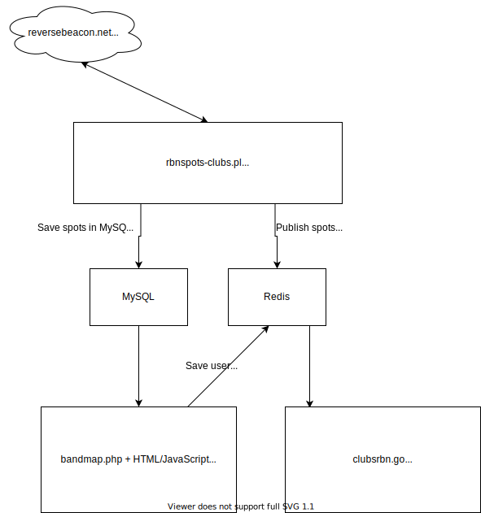

# CW Club RBN Spotter

This repository contains the source code for the CW Club RBN Spotter, which is
deployed at https://rbn.telegraphy.de/

## Member data

To separate source code and data, the membership data (folder `src/members`) is 
living in a separate repository: https://git.fkurz.net/dj1yfk/cwclubspotterdata

# Functional Overview

There are three main functions on rbn.telegraphy.de:

* The [bandmap](https://rbn.telegraphy.de/) offers a live overview of 
  spotted stations from the RBN in the *web browser*, with the possibility
  to filter it by various criteria (club membership, band, continent, speed,
  spot age).

* The [telnet server](telnet://rbn.telegraphy.de:7000/) offers the same
  data and it can be accessed either by a simple telnet program or (more
  commonly) by a logging program which then displays the received spots
  in a suitable fashion (e.g. as a bandmap, with highlights for "needed"
  stations, new countries, ...)

* The [RBN statistics](https://rbn.telegraphy.de/activity/rank) functions,
  which show historical RBN data for *all* stations *ever* spotted on the RBN
  in various formats (individual report for a callsign, different rankings).

## Architecture

** Under construction **

The CW Club RBN spotter uses simple and battle-tested technology: PHP, Perl,
shell scripts, MySQL and Redis databases. The following graph shows the
building blocks that make up the system:

